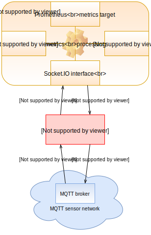

# laporte-mqtt

 - bidirectional MQTT connector for [Laporte](https://github.com/vinklat/laporte).
 - it can take, convert and push metrics from MQTT sensors
 - immediately publish changes (like actuators, relays) to MQTT

## Schema:

## Features:

 - can subscribe/publish multiple topics
 - JSON and also single values in payloads are supported
 - tested with [zigbee2mqtt](https://github.com/koenkk/zigbee2mqtt), [Tasmota](https://github.com/arendst/Tasmota), RFLink, [nibe-mqtt](https://github.com/vinklat/nibe-mqtt) and others

## Installation:
To install from PyPI:

`pip install laporte-mqtt`

Or using container image from Docker Hub:

`docker pull vinklat/laporte-mqtt`

## Quick HOWTO:

please wait a bit longer, examples are in development...
